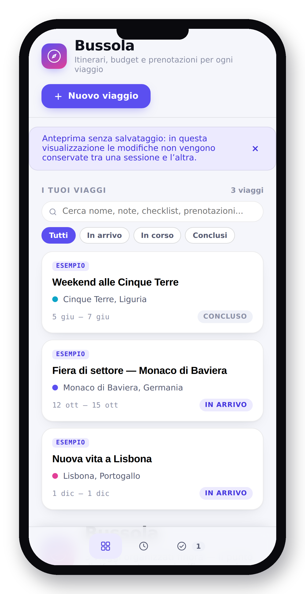

# 🧭 Bussola

**Bussola** è una web app per organizzare viaggi — itinerari, budget, checklist e prenotazioni, tutto in un unico posto. Funziona anche come **app installabile sul telefono** (PWA), con supporto offline.

**🔗 Demo live:** [8rrm7tvzcf-droid.github.io/Bussola-pwa](https://8rrm7tvzcf-droid.github.io/Bussola-pwa/)



## Funzionalità

- **Itinerario** — organizza le tappe giorno per giorno, con orari e note.
- **Budget e spese** — tieni traccia di quanto hai pianificato e di quanto hai speso, in qualsiasi valuta, con suddivisione per categoria e saldi tra partecipanti.
- **Checklist e documenti** — liste di cose da fare, documenti e bagagli da non dimenticare prima di partire.
- **Prenotazioni** — raccogli voli, hotel e altre prenotazioni con riferimenti e link.
- **Trasferimenti** — gestisce anche viaggi speciali come un trasloco o una nuova vita in un'altra città.
- **Backup ed esportazione** — esporta i dati dei tuoi viaggi in qualsiasi momento.
- **Installabile e offline** — aggiungila alla schermata Home del telefono e usala anche senza connessione.

## Come è fatta

Un'unica pagina HTML, senza framework esterni: HTML, CSS e JavaScript vanilla. I dati vengono salvati in locale sul dispositivo (`localStorage`), così l'app funziona anche offline grazie a un **Service Worker** e a un **Web App Manifest** che la rendono installabile come applicazione nativa su Android e iOS.

## Provarla in locale

Non servono build tool: basta un piccolo server statico.

```bash
git clone https://github.com/8rrm7tvzcf-droid/Bussola-pwa.git
cd Bussola-pwa
python3 -m http.server 8000
```

Poi apri `http://localhost:8000` nel browser.

## Installarla sul telefono

- **Android (Chrome):** apri il link della demo, apri il menu (⋮) e tocca "Aggiungi a schermata Home" / "Installa app".
- **iPhone (Safari):** apri il link della demo, tocca l'icona di condivisione, poi "Aggiungi alla schermata Home".
